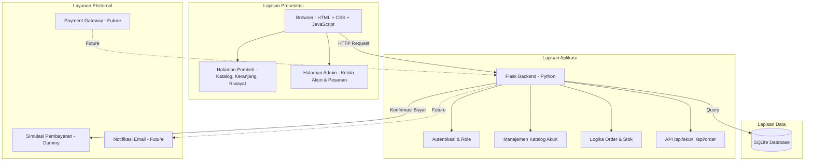
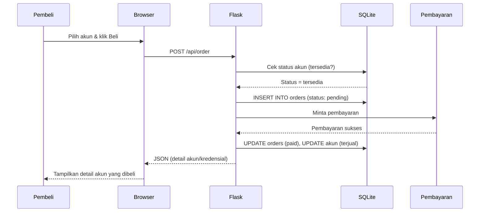
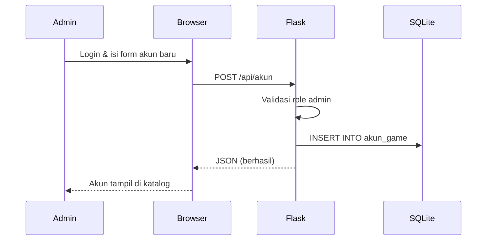
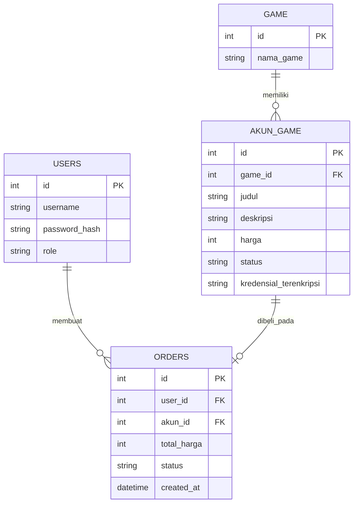

# ARSITEKTUR SISTEM — Toko Akun Game Online

## 1. Diagram Arsitektur

## 2. Penjelasan Layer

| Layer | Komponen | Fungsi |
|-------|----------|--------|
| **Presentasi** | HTML, CSS, JavaScript | Menampilkan katalog akun, keranjang, dan dashboard admin |
| **Aplikasi** | Flask (Python) | Memproses request, autentikasi, logika order dan stok |
| **Data** | SQLite | Menyimpan data user, akun game, pesanan, dan transaksi |
| **Layanan Eksternal** | Simulasi Pembayaran / Payment Gateway | Memproses dan mengonfirmasi pembayaran |

## 3. Alur Komunikasi

### 3.1 Alur Pembelian Akun

### 3.2 Alur Admin Menambah Akun

## 4. Rancangan Tabel Database

## 5. Teknologi yang Digunakan

| Komponen | Teknologi | Alasan |
|----------|-----------|--------|
| Backend | Flask | Ringan, mudah dipelajari |
| Database | SQLite | Tidak perlu server, portable |
| Frontend | HTML + CSS + JavaScript | Sederhana, tanpa framework berat |
| Keamanan | Werkzeug (hash password) | Password tidak disimpan sebagai teks biasa |
| Pembayaran | Simulasi (dummy) | Bisa didemokan tanpa akun merchant |
| Version Control | Git + GitHub | Standar industri |
| Diagram | Mermaid | Render langsung di GitHub |

## 6. Kelebihan Arsitektur Ini

- **Modular** - Setiap layer terpisah, mudah dikembangkan
- **Tanpa Layanan Berbayar** - Bisa jalan dengan simulasi pembayaran
- **Future-proof** - Siap diintegrasikan dengan payment gateway (mis. Midtrans) dan email notifikasi
- **Aman** - Ada pemisahan role (pembeli/admin) dan password ter-hash
- **Ringan** - Tidak butuh server besar
