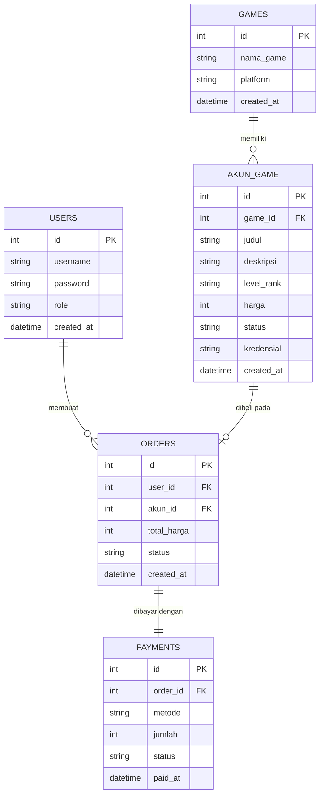

# ENTITY RELATIONSHIP DIAGRAM (ERD)
## Toko Akun Game Online

## 1. Diagram ERD

## 2. Detail Tabel

### Tabel: `users`
| Field | Tipe | Keterangan |
|-------|------|-----------|
| id | INTEGER | Primary Key, Auto Increment |
| username | VARCHAR(50) | Unique, Not Null |
| password | VARCHAR(255) | Hash, Not Null |
| role | VARCHAR(10) | `pembeli` atau `admin`, Default `pembeli` |
| created_at | DATETIME | Default CURRENT_TIMESTAMP |

### Tabel: `games`
| Field | Tipe | Keterangan |
|-------|------|-----------|
| id | INTEGER | Primary Key |
| nama_game | VARCHAR(100) | Unique, Not Null (mis. Mobile Legends, Valorant) |
| platform | VARCHAR(50) | Mis. Mobile, PC, Console |
| created_at | DATETIME | Default CURRENT_TIMESTAMP |

### Tabel: `akun_game`
| Field | Tipe | Keterangan |
|-------|------|-----------|
| id | INTEGER | Primary Key |
| game_id | INTEGER | Foreign Key ke games.id |
| judul | VARCHAR(150) | Not Null (mis. "Akun Mythic Full Skin") |
| deskripsi | TEXT | Detail isi akun (hero, skin, item) |
| level_rank | VARCHAR(50) | Rank/level akun |
| harga | INTEGER | Harga dalam Rupiah, Not Null |
| status | VARCHAR(10) | `tersedia` atau `terjual`, Default `tersedia` |
| kredensial | TEXT | Data login akun, terenkripsi, hanya tampil setelah dibayar |
| created_at | DATETIME | Default CURRENT_TIMESTAMP |

### Tabel: `orders`
| Field | Tipe | Keterangan |
|-------|------|-----------|
| id | INTEGER | Primary Key |
| user_id | INTEGER | Foreign Key ke users.id |
| akun_id | INTEGER | Foreign Key ke akun_game.id |
| total_harga | INTEGER | Harga saat pembelian (Rupiah) |
| status | VARCHAR(10) | `pending`, `paid`, atau `batal`, Default `pending` |
| created_at | DATETIME | Default CURRENT_TIMESTAMP |

### Tabel: `payments`
| Field | Tipe | Keterangan |
|-------|------|-----------|
| id | INTEGER | Primary Key |
| order_id | INTEGER | Foreign Key ke orders.id, Unique |
| metode | VARCHAR(30) | Mis. Transfer Bank, E-Wallet (simulasi) |
| jumlah | INTEGER | Nominal pembayaran (Rupiah) |
| status | VARCHAR(10) | `menunggu`, `sukses`, atau `gagal` |
| paid_at | DATETIME | Waktu pembayaran berhasil, boleh kosong |

## 3. Relasi Antar Tabel

| Relasi | Tipe | Keterangan |
|--------|------|-----------|
| users -> orders | One to Many | 1 pembeli bisa membuat banyak pesanan |
| games -> akun_game | One to Many | 1 game punya banyak akun yang dijual |
| akun_game -> orders | One to One (opsional) | 1 akun hanya bisa terjual satu kali |
| orders -> payments | One to One | 1 pesanan punya 1 data pembayaran |
