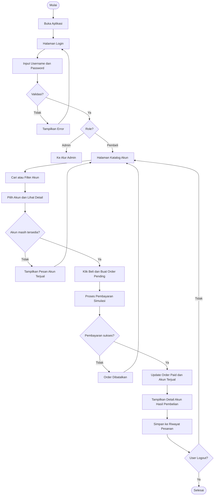
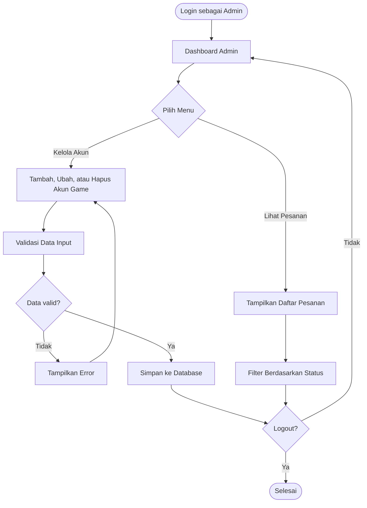
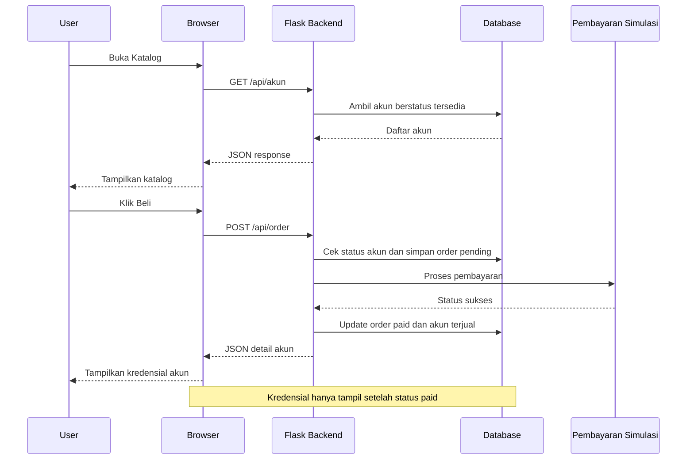

# FLOWCHART APLIKASI — Toko Akun Game Online

## Alur Utama Sistem (Pembeli)

## Alur Admin

## Penjelasan Alur

1. **Mulai** - Aplikasi dibuka oleh pembeli atau admin
2. **Login** - Pengguna memasukkan username dan password
3. **Validasi** - Jika gagal, tampilkan error; jika berhasil, sistem cek role
4. **Katalog** - Pembeli melihat daftar akun game, bisa dicari dan difilter berdasarkan game atau harga
5. **Cek Ketersediaan** - Sistem memastikan akun belum terjual sebelum order dibuat
6. **Order Pending** - Order dibuat dengan status `pending` saat pembeli klik Beli
7. **Pembayaran** - Pembayaran diproses secara simulasi; jika gagal, order dibatalkan
8. **Update Status** - Jika sukses, order menjadi `paid` dan akun menjadi `terjual`
9. **Tampil Kredensial** - Data login akun hanya ditampilkan setelah pembayaran berhasil
10. **Simpan Riwayat** - Transaksi tersimpan di database dan bisa dilihat di riwayat pesanan
11. **Alur Admin** - Admin mengelola akun game dan memantau pesanan
12. **Loop** - Proses berulang hingga pengguna logout

## Diagram Alur Data

