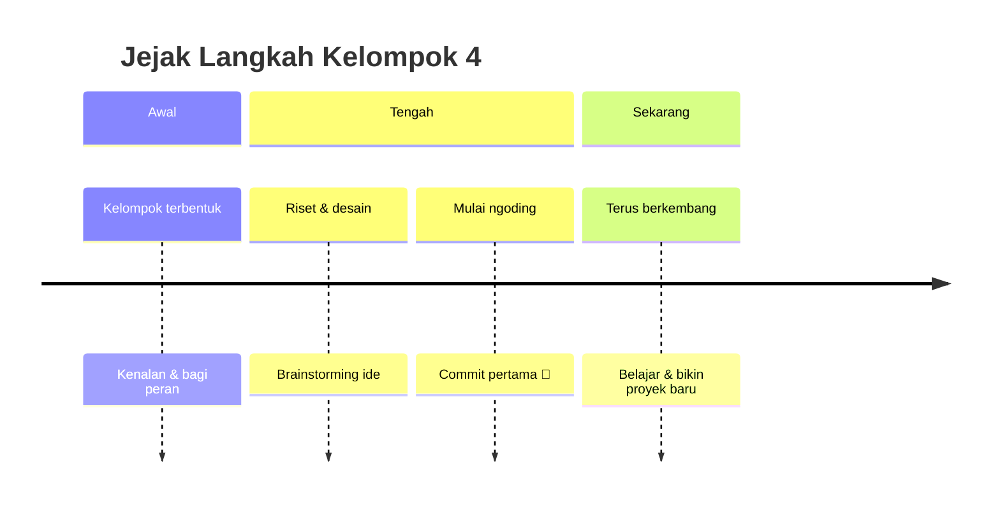

<!-- ============================================================
  PROFILE README - KELOMPOK 4
  Cara pakai:
  1. Buat repository publik dengan nama SAMA PERSIS dengan username/organisasi GitHub kalian
  2. Simpan file ini sebagai README.md di repo tersebut
  3. Ganti semua teks yang ada tanda [ ... ] dan USERNAME
============================================================= -->

<div align="center">


<a href="https://git.io/typing-svg">
  
</a>

<br/>


</div>

---

## 🖥️ `kelompok4.config.js`

```js
const kelompok4 = {
  nama: "Kelompok 4",
  motto: "Kalau ada bug, kita debug bareng. Kalau ada deadline, kita begadang bareng.",
  kampus: "[Nama Kampus / Sekolah]",
  mataKuliah: "[Nama Mata Kuliah / Proyek]",
  anggota: 4,
  fokus: ["Web Development", "UI/UX", "Problem Solving"],
  superpower: "Kompak di saat-saat genting ⚡",
  sedangDipelajari: ["[Teknologi 1]", "[Teknologi 2]"],
  bukaKolaborasi: true,
};
```

---

## 👥 Tim Kami

<div align="center">

<table>
  <tr>
    <td align="center" width="25%">
      <a href="https://github.com/USERNAME1">
        
      </a>
      <br/><br/>
      <b>[Nama Anggota 1]</b><br/>
      <sub>🧠 Ketua · Project Lead</sub><br/>
      <sub>"[Kutipan singkat]"</sub>
    </td>
    <td align="center" width="25%">
      <a href="https://github.com/USERNAME2">
        
      </a>
      <br/><br/>
      <b>[Nama Anggota 2]</b><br/>
      <sub>💻 Frontend Developer</sub><br/>
      <sub>"[Kutipan singkat]"</sub>
    </td>
    <td align="center" width="25%">
      <a href="https://github.com/USERNAME3">
        
      </a>
      <br/><br/>
      <b>[Nama Anggota 3]</b><br/>
      <sub>⚙️ Backend Developer</sub><br/>
      <sub>"[Kutipan singkat]"</sub>
    </td>
    <td align="center" width="25%">
      <a href="https://github.com/USERNAME4">
        
      </a>
      <br/><br/>
      <b>[Nama Anggota 4]</b><br/>
      <sub>🎨 UI/UX & Dokumentasi</sub><br/>
      <sub>"[Kutipan singkat]"</sub>
    </td>
  </tr>
</table>

</div>

---

## 🧰 Tech Stack

<div align="center">


</div>

> 💡 *Hapus atau tambah badge sesuai teknologi yang benar-benar kalian pakai. Cari ikon lain di [shields.io](https://shields.io) atau [simpleicons.org](https://simpleicons.org).*

---

## 🚀 Proyek Unggulan

<div align="center">

| Proyek | Deskripsi | Teknologi | Status |
|:------:|:----------|:----------|:------:|
| **[Nama Proyek 1](https://github.com/USERNAME/REPO1)** | [Deskripsi singkat proyek pertama] | `React` `Node.js` | ✅ Selesai |
| **[Nama Proyek 2](https://github.com/USERNAME/REPO2)** | [Deskripsi singkat proyek kedua] | `Python` `MySQL` | 🔧 Dikerjakan |
| **[Nama Proyek 3](https://github.com/USERNAME/REPO3)** | [Deskripsi singkat proyek ketiga] | `HTML` `CSS` `JS` | 💡 Rencana |

</div>

---

## 🗺️ Perjalanan Kami



---

## 📊 Statistik GitHub

<div align="center">


<br/>


<br/><br/>


</div>

> 📌 *Ganti `USERNAME` dengan username GitHub ketua kelompok atau nama organisasi.*

---

## 🤝 Aturan Main Kelompok 4

- 🗣️ **Komunikasi itu kunci**: kabari kalau ada kendala, jangan diam-diam pusing sendiri.
- 🌿 **Satu fitur, satu branch**: rapi di repo, tenang di hati.
- 🔍 **Review sebelum merge**: dua mata lebih baik daripada satu.
- ☕ **Istirahat itu wajib**: kode bagus lahir dari otak yang segar.
- 🎉 **Rayakan setiap progres**, sekecil apa pun.

---

## 📬 Hubungi Kami

<div align="center">

[](mailto:emailkelompok4@example.com)
[](https://instagram.com/USERNAME)
[](https://linkedin.com/in/USERNAME)
[](https://discord.gg/INVITE)

<br/>


<br/>

*"Sendirian kita cepat, bersama-sama kita jauh."* 🌏


</div>
