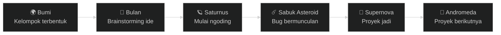

<!-- ============================================================
  PROFILE README - KELOMPOK 5 (GALAXY GELAP / DEEP SPACE)
  Cara pakai:
  1. Buat repository publik dengan nama SAMA PERSIS dengan username/organisasi GitHub kalian
  2. Simpan file ini sebagai README.md di repo tersebut
  3. Ganti semua teks [ ... ] dan USERNAME
  (Cukup satu file ini saja, tidak perlu file tambahan)
============================================================= -->

<div align="center">


<a href="https://git.io/typing-svg">
  
</a>

<br/>


</div>

---

<div align="center">

## 🌌 TRANSMISI DARI KELOMPOK 5 🌌

</div>

<div align="center">


</div>

<div align="center">

| 🌍 Planet Asal | 🔭 Misi Utama | 🌠 Tujuan |
|:--------------:|:-------------:|:---------:|
| [Nama Kampus] | [Mata Kuliah / Proyek] | Mendarat di nilai A! |

</div>

---

<div align="center">

## ☄️ KRU PENJELAJAH GALAKSI ☄️

<table>
  <tr>
    <td align="center" width="25%">
      <h1>🌠</h1>
      <a href="https://github.com/USERNAME1">
        
      </a>
      <br/><b>[Nama Anggota 1]</b><br/>
      <sub>🧭 <i>Komandan Bintang</i></sub><br/>
      <sub>Kekuatan: <code>Navigasi & Planning</code></sub>
    </td>
    <td align="center" width="25%">
      <h1>🪐</h1>
      <a href="https://github.com/USERNAME2">
        
      </a>
      <br/><b>[Nama Anggota 2]</b><br/>
      <sub>💻 <i>Penjaga Saturnus</i></sub><br/>
      <sub>Kekuatan: <code>Frontend</code></sub>
    </td>
    <td align="center" width="25%">
      <h1>☄️</h1>
      <a href="https://github.com/USERNAME3">
        
      </a>
      <br/><b>[Nama Anggota 3]</b><br/>
      <sub>⚙️ <i>Pemburu Komet</i></sub><br/>
      <sub>Kekuatan: <code>Backend</code></sub>
    </td>
    <td align="center" width="25%">
      <h1>🌌</h1>
      <a href="https://github.com/USERNAME4">
        
      </a>
      <br/><b>[Nama Anggota 4]</b><br/>
      <sub>🎨 <i>Pelukis Nebula</i></sub><br/>
      <sub>Kekuatan: <code>UI/UX & Dokumen</code></sub>
    </td>
  </tr>
</table>

</div>

> 💬 **🌠:** "Peluncuran dalam 3... 2... 1..."
> 💬 **🪐:** "Tunggu! Tombol *submit*-nya hilang ditelan lubang hitam!"
> 💬 **☄️:** "Server terdeteksi meledak seperti supernova."
> 💬 **🌌:** "Tenang, backup-nya sudah kusimpan di ujung galaksi. 🌙"

---

<div align="center">

## 🔭 PERALATAN ANTARIKSA 🔭


</div>

> 💡 *Hapus badge yang tidak dipakai, tambah yang baru di [shields.io](https://shields.io).*

---

<div align="center">

## 🛰️ MISI YANG SEDANG BERJALAN 🛰️

</div>

| 🌌 Tujuan | 🎯 Nama Misi | 🔋 Bahan Bakar | 📊 Status |
|:---------:|:-------------|:---------------|:---------:|
| 🌍 **Bumi** | [**Nama Proyek 1**](https://github.com/USERNAME/REPO1) — [deskripsi singkat] | `React` `Node.js` | ✅ **Mendarat** |
| 🪐 **Saturnus** | [**Nama Proyek 2**](https://github.com/USERNAME/REPO2) — [deskripsi singkat] | `Python` `MySQL` | 🚀 Dalam Perjalanan |
| 🌌 **Andromeda** | [**Nama Proyek 3**](https://github.com/USERNAME/REPO3) — [deskripsi singkat] | `HTML` `CSS` `JS` | 🔭 Masih Diintai |

```
  ⚡ ENERGI BINTANG : ████████░░  80%
  🛡️ PERISAI        : ██████████ 100%
  ☕ KOPI           : ███░░░░░░░  30%   ⚠️ PERINGATAN: ISI ULANG SEGERA!
```

---

<div align="center">

## 🌠 PETA PERJALANAN GALAKSI 🌠

</div>



---

<div align="center">

## 📊 STATISTIK KRU 📊


<br/>


</div>

> 📌 *Ganti `USERNAME` dengan username ketua atau nama organisasi.*

---

<div align="center">

## 📜 HUKUM ANTARIKSA KELOMPOK 5 📜

</div>

1. 🌟 **Satu fitur, satu branch.** Jangan tabrakan di orbit `main`!
2. 📡 **Komunikasi lancar**: ada masalah, kirim sinyal SOS ke grup.
3. 🔍 **Review dulu, merge kemudian**, biar pesawat tidak bocor.
4. 🍕 **Traktir pizza** setiap proyek berhasil mendarat.
5. 😴 **Penjelajah wajib tidur**, bug juga butuh istirahat.
6. ✨ **Rayakan setiap misi selesai**, sekecil apa pun!

---

<div align="center">

## 📮 KIRIM SINYAL KE KAMI 📮

[](mailto:emailkelompok5@example.com)
[](https://instagram.com/USERNAME)
[](https://linkedin.com/in/USERNAME)
[](https://discord.gg/INVITE)

<br/>


<br/>

```
   ✦ ────────────────────────────────────────── ✦
     "Kami tidak sekadar menatap bintang,
      kami membangun roket untuk menggapainya."  🌠
   ✦ ────────────────────────────────────────── ✦
```


</div>
